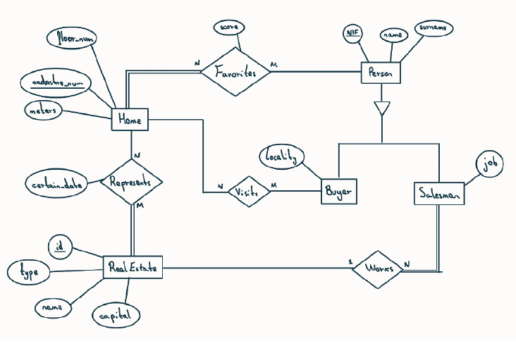

# Base de Datos de Venta de Viviendas (Oracle SQL)

Este es un proyecto académico de diseño e implementación de bases de datos, desarrollado durante mi estancia Erasmus. El objetivo es modelar y gestionar las interacciones en un sistema de venta de inmuebles.

El proyecto abarca desde el diseño conceptual (Diagrama Entidad-Relación) y la normalización (hasta 3NF), hasta la implementación física en Oracle SQL, incluyendo la creación de tablas (DDL), inserción de datos (DML) y consultas complejas.

## Diagrama Entidad-Relación (E-R)

El sistema modela 5 entidades principales: Viviendas, Inmobiliarias y Personas, que se subdividen en Compradores y Vendedores.

## Diseño y Normalización

La base de datos está diseñada para ser eficiente y evitar la redundancia de datos.

* **Relaciones M:N:** Las relaciones Muchos-a-Muchos se han resuelto mediante tablas puente.
* **Normalización:** Todas las tablas están en **Tercera Forma Normal (3NF)**, asegurando que todos los atributos dependen directamente de la clave primaria y no existen dependencias transitivas.

## Implementación SQL

El archivo `SQLscript.sql` (o `schema.sql`) contiene el script completo para:
1.  **DDL:** `CREATE TABLE` para todas las entidades y tablas puente (`Person`, `Home`, `RealEstate`, `Favorites`, `Visits`, etc.).
2.  **DML:** `INSERT INTO` para poblar la base de datos con datos de ejemplo.
3.  **Consultas:** Ejemplos de consultas (`SELECT`, `UPDATE`, `DELETE`) para probar la base de datos.
